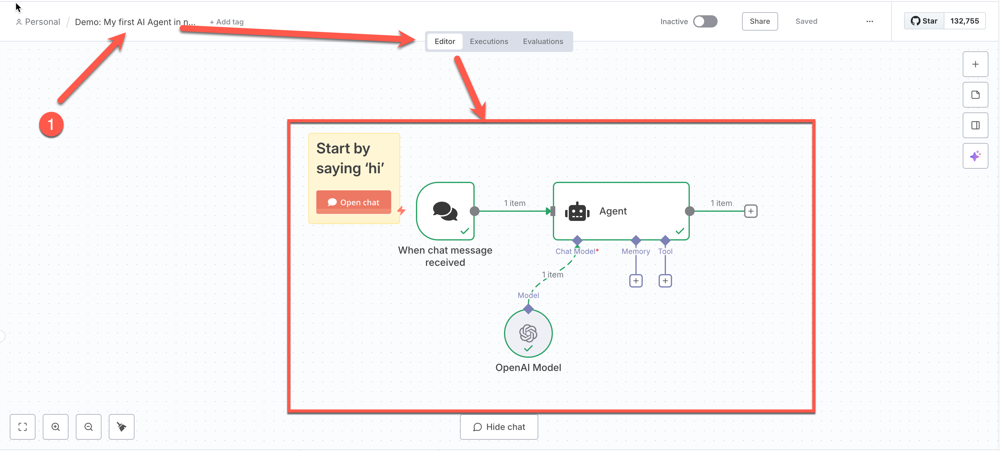
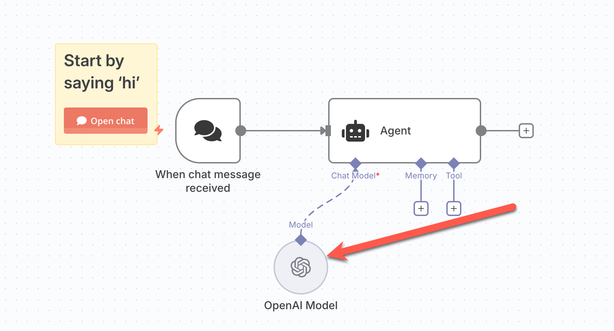

# Lesson 01 — Getting Started with n8n (Hello Finance Workflow)

## สิ่งที่จะสร้าง
- สมัครและเข้าใช้งาน n8n รู้จักหน้าตาเครื่องมือ และสร้าง Workflow

## Prerequisites:
[TH] ข้อกำหนดก่อนเริ่ม
- มีบัญชี n8n - [สร้างบัญชีที่นี่](https://app.n8n.cloud/dashboard) | [วิธีการสร้างบัญชี n8n ใช้งาน](register.md)
- Modern Web Browser 

## ผลลัพธ์
- เข้าใช้งานได้ รู้จักหน้าตาเครื่องมือ ใช้โหนดหลัก และทดสอบเวิร์กโฟลว์ได้ครบ

## ขั้นตอน

### Step 1. สำรวจเครื่องมือ
1. กดเปิด Instance 
2. จากเมนูด้านซ้าย > เลือก Personal > เลือก tab "Workflows" > เลือก **Test a simple AI Agent Example**
   
3. สังเกตว่า ระบบสร้างและตั้งชื่อตัวอย่างของ workflow ไว้ พร้อมหน้าจอที่เปิดขึ้นมาแสดงตัวอย่าง workflow 
   

### Step 2. ตั้งค่าการเชื่อมต่อ

1. คลิกเปิด Node ที่ชื่อว่า OpenAI Model
    

2. จากหน้าต่างที่การตั้งค่าของ Node **OpenAI Model** ขึ้นมา กด claim credit 
   

3. ถ้าการขอเครดิตสำเร็จ จะมีข้อความยืนยันปรากฏขึ้นเป็นกล่องสีเขียว > ให้เช็คค่าดังนี้:
   - **Credential to connect with:** n8n free OpenAI API credits
   - **Model:** gpt-4o-mini
   - เรียบร้อยแล้ว กดปิดหน้าต่างโดยการ กดปุ่ม back to canvas ด้านบนซ้ายของหน้าจอ 
   

4. กดปุ่ม **Open Chat** ที่อยู่บน workflow
   

5. สังเกตช่องแชทด้านล่าง > พิมพ์ข้อความ `hi` ลงไปในช่องแชทและกดปุ่ม enter > หลังการทำงานเสร็จเรียบร้อย ให้เช็คข้อความที่ Model ส่งกลับมาในส่วน output
   

### Step 3: Check the environment 

1. จากหน้า Editor ให้เรากดเลือกส่วน Execution ของ workflow > เพื่อตรวจสอบบันทึกการทำงานของ workflow ทางด้านซ้าย > ตรวจดูการทำงานของ node แต่ละส่วนใน workflow (ซึ่งเป็นสีเขียวแสดงว่าทำงานได้ไม่ติดปัญหา) > ดูประวัติการทำงานของ node ต่างๆ ได้ 
   
2. จากเมนูด้านซ้ายสุด กดเลือกเมนู Personal เพื่อกลับมาดู workflow ต่างๆ 
   
3. กดดู tab "Workflows" จะเห็นชื่อ workflow ที่เราสร้างและทดสอบก่อนหน้านี้อยู่ ซึ่งสามารถกดเปิดเข้าไปแก้ไขได้
   
4. กดดู tab "Executions" จะเห็นประวัติการทำงานของ workflow ที่เราสร้างและทดสอบก่อนหน้านี้อยู่ ซึ่งสามารถกดเปิดเข้าไปดูรายละเอียดได้
   
5. กดดู tab "Credentials" จะเห็นข้อมูลการเชื่อมต่อที่เราใช้ใน workflow ต่างๆ ได้
   

## สรุป

ในบทเรียนนี้เราได้เรียนรู้การใช้งาน n8n เบื้องต้น โดยได้สร้าง workflow  ที่สามารถรับ prompt ทำงานกับ AI model และตอบกลับได้ นอกจากนี้ยังได้สำรวจเครื่องมือและฟีเจอร์ต่างๆ ของ n8n รวมถึงการตั้งค่าการเชื่อมต่อกับ OpenAI Model และการตรวจสอบบันทึกการทำงานของ workflow
