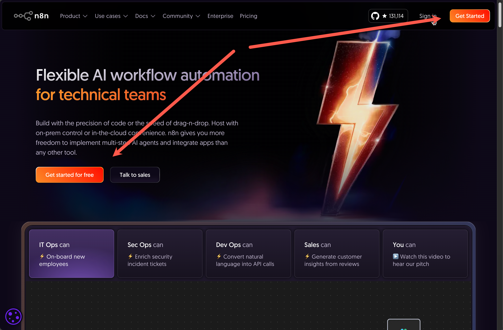
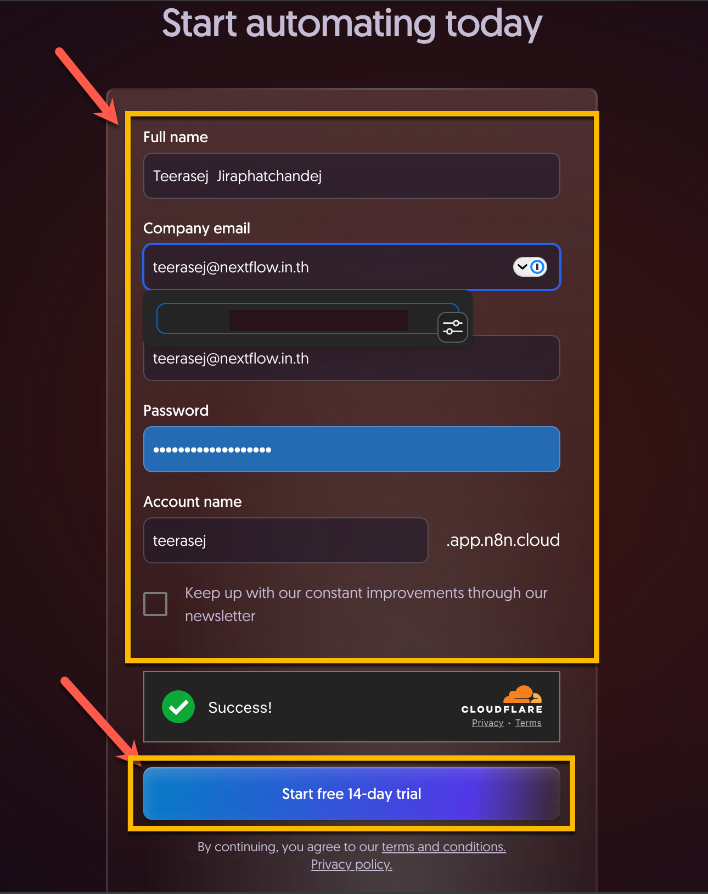
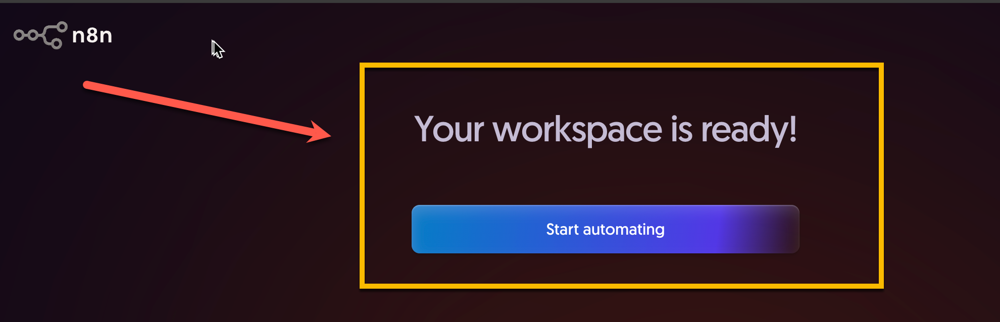
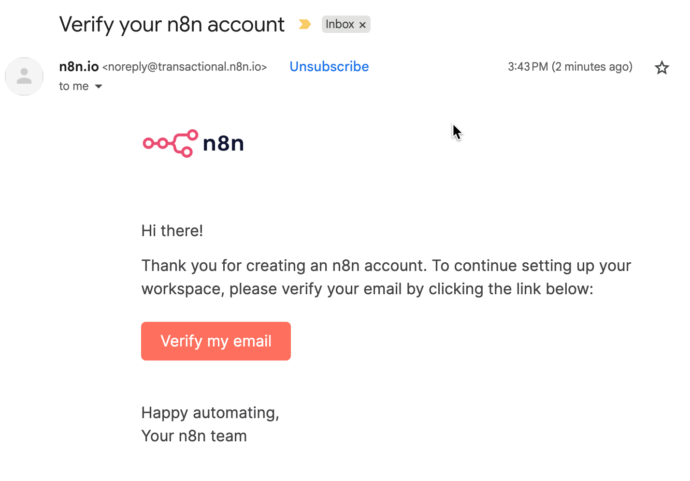
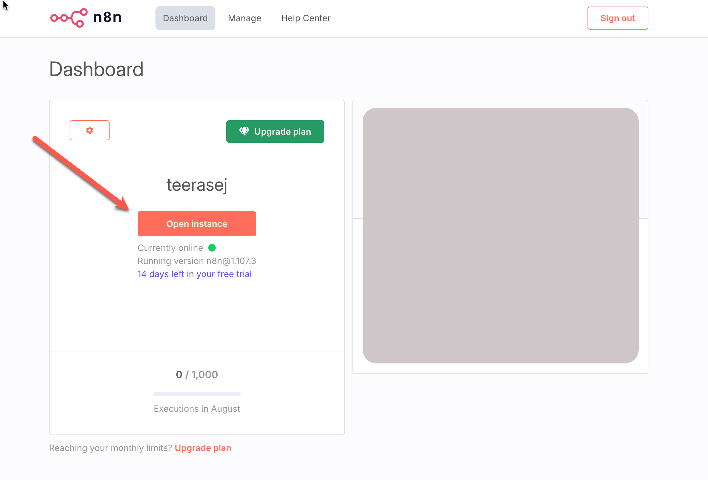

# บทเรียนที่ 02 — ลงทะเบียนบัญชี n8n Cloud 

## สิ่งที่คุณจะสร้าง
- บัญชี n8n Cloud ที่ยืนยันแล้ว พร้อมเวิร์กสเปซสำหรับใช้งานในบทเรียน

## สิ่งที่ต้องมีล่วงหน้า
- อีเมลที่ใช้งานได้
- อินเทอร์เน็ตเสถียรและเบราว์เซอร์รุ่นใหม่ เช่น
    - [Google Chrome — ดาวน์โหลด](https://www.google.com/chrome/)
    - [Microsoft Edge — ดาวน์โหลด](https://www.microsoft.com/edge)
- ควรให้แน่ใจว่าเครื่องคอมพิวเตอร์ที่ใช้ สามารถเข้าใช้งาน Website ทั่วไปได้

## เวลาที่ใช้
- ~10–15 นาที

## ผลลัพธ์
- คุณสามารถลงชื่อเข้าใช้ n8n Cloud และเปิดหน้าต่าง Editor UI ได้
- คุณมีเวิร์กสเปซพร้อมสำหรับบทเรียนถัดไป

## ขั้นตอน

### ขั้นตอนที่ 1: เปิดหน้า Sign‑up ของ n8n Cloud
- วิธีทำ:
    - เปิดหน้าเว็บของ n8n ในเบราว์เซอร์ (https://n8n.io/)
    - คลิก “Get Started for free” เพื่อเปิดฟอร์มลงทะเบียน
- วิธีตรวจสอบผลลัพธ์ในขั้นตอนนี้: เห็นฟอร์มให้กรอกอีเมลและรหัสผ่าน

### ขั้นตอนที่ 2: กรอกรายละเอียด, อีเมลและตั้งรหัสผ่านที่รัดกุม

- วิธีทำ:
    1. กรอกชื่อ - นามสกุล
    2. พิมพ์อีเมลของคุณ และอีเมลล์เดิมเพื่อยืนยัน
    3. ตั้งรหัสผ่านที่รัดกุม มีตัวอักษร ตัวเลข และสัญลักษณ์
    4. ตั้งชื่อ Account
    5. คลิก **Start free 14-day trial** 
    6. ตอบ Survey ตามความเหมาะสม
    7. ในส่วน **Invite team members to your workspace** ให้กดปุ่ม **Skip** เพื่อข้ามขั้นตอน
       
- วิธีตรวจสอบผลลัพธ์ในขั้นตอนนี้: เห็นข้อความขึ้นว่า Your workspace is ready
  

### ขั้นตอนที่ 3: ยืนยันอีเมลของคุณ
- วิธีทำ:
    - เปิดกล่องอีเมลและหาอีเมลจาก n8n
    - คลิกปุ่ม “Verify email” ในอีเมล
    - กลับมาที่แท็บเบราว์เซอร์ถ้าไม่เปิดอัตโนมัติ

- วิธีตรวจสอบผลลัพธ์ในขั้นตอนนี้: เบราว์เซอร์แสดงว่าอีเมลของคุณได้รับการยืนยันแล้ว และจะเข้าสู่ Dashboard ดังภาพด้านล่าง

### ขั้นตอนที่ 4: ทดสอบดาวน์โหลดไฟล์

- วิธีทำ
  - กดเปิด link นี้ [--> snippet](../../snippets/lesson-02/sample-webhook-payload.json)
  - คลิกขวาแล้วเลือก “Save link as...” เพื่อดาวน์โหลดไฟล์ โดยตั้งให้นามสกุลไฟล์เป็น **.json**
  - ทดสอบเปิดไฟล์ที่ดาวน์โหลดมาใน Notepad หรือ TextEdit
- วิธีตรวจสอบผลลัพธ์ในขั้นตอนนี้: เห็นไฟล์ JSON ที่ดาวน์โหลดมาในโปรแกรมแก้ไขข้อความ

## แก้ปัญหา
- ไม่ได้รับอีเมลยืนยัน: ตรวจสอบโฟลเดอร์สแปม หรือ คลิก “Resend verification email”
- อีเมลถูกใช้แล้ว: ลอง “Sign in” หรือใช้อีเมลอื่น
- รหัสผ่านอ่อน: เพิ่มความยาว และผสมตัวอักษร ตัวเลข และสัญลักษณ์

