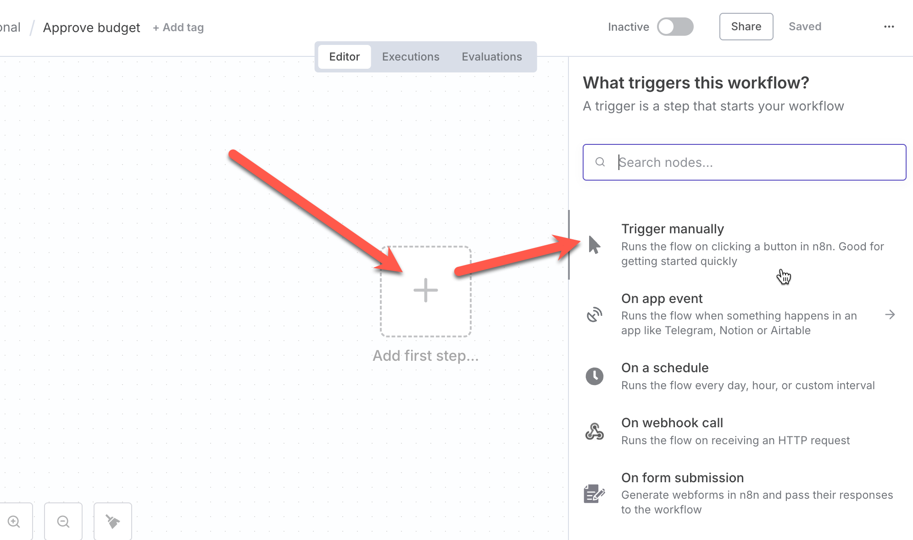

# Lesson 02 — Core Nodes & Conditions

## ขั้นตอน

### Step 1: สร้าง Workflow และ trigger

1. เข้าหน้า Dashboard ผ่าน [https://app.n8n.cloud/dashboard](https://app.n8n.cloud/dashboard) > กดปุ่ม Open instance
2. กดปุ่ม **Create Workflow**
3. จากส่วน editor ให้คลิกที่ชื่อ workflow ด้านบนซ้าย > เปลี่ยนชื่อเป็น `Approve budget` > กด enter
   
4. จากกลางหน้า editor ให้คลิกที่ปุ่ม **+** เพื่อเพิ่ม Node trigger > เลือก **Trigger Manually**
   

### Step 2: สร้าง Node กำหนดค่าตัวแปร

5. จากด้านซ้ายของ Node แรก ให้คลิกปุ่ม **+** เพื่อเพิ่ม Node > ค้นหา node ชื่อ `Set` > เลือก **Edit Field (set)**
6. จากหน้าต่างที่เปิดขึ้นมาให้คลิกที่ชื่อ node ด้านบน และเปลี่ยนชื่อเป็น `Load Project Info` > เลือก **Mode: Manual mapping** > กดปุ่ม **Add field**
   
7. กรอก field 2 ตัวตามข้อมูลดังนี้ และกดปุ่ม back to canvas ด้านบนซ้ายของหน้าจอ
   - `CompanyName`, type: **String**, `Nextflow`
   - `projectBudget`, type: **Number**, `4000000`
  

### Step 3: สร้าง Node ตรวจสอบเงื่อนไข

8. กดปุ่ม **+** เพื่อเพิ่ม node ใหม่ > เลือก **Flow node** > เลือก **If** node 
  
9. จากหน้าต่าง node ให้กดปุ่ม execute previous node เพื่อให้สามารถดึงค่าจาก node ก่อนหน้ามาใช้ใน If node ได้
    
10. จะเห็นว่าเรามีค่าตัวแปรจาก node ก่อนหน้า > ให้กดลากชื่อ `projectBudget` มาวางไว้ในหน้าต่าง condition > เลือกการเปรียบเทียบ **greater than** > กำหนดค่าเป็น `1000000`
    
11. กดปุ่ม execute step ที่อยู่บนหน้าต่างเพื่อทดสอบการทำงาน > จะเห็นผลลัพธ์ว่าค่าตัวแปร projectBudget ไปแสดงในส่วนของ **Output: true branch** ตามการตรวจสอบ 
    
12. ปิดหน้าต่าง node 
    
### Step 4: กำหนด message สำหรับ If node 2 กรณีที่แตกต่างกัน

1. เพิ่ม Node ถัดไปโดยการคลิกที่ปุ่ม **+** ของ flow `true` และเลือก **Set**
2. กำหนดให้ node กำหนดตัวแปร **messsage** เป็นข้อความว่า 
   ```
   Project: {{ $json.CompanyName }} required review.
   ```
   
3. ทำแบบเดียวกับ flow `false` แต่ให้กำหนดตัวแปร **messsage** เป็นข้อความว่า 
   ```
   Project: {{ $json.CompanyName }} has been approved.
   ```
4. กดปุ่ม **Back to Canvas** เพื่อกลับไปที่หน้า Canvas
5. ทดสอบรัน workflow โดยกดปุ่ม **Execute Workflow** และตรวจสอบการทำงานของ node ต่างๆ จากหน้าจอด้านล่าง

### Step 3: ทดสอบ Workflow

1. กลับไปที่หน้า Dashboard และเปิด Workflow ที่สร้างขึ้น
2. คลิกที่ปุ่ม **Execute Workflow** เพื่อทดสอบ
3. ตรวจสอบผลลัพธ์ที่ได้จากการทดสอบ

## สรุป

ในบทเรียนนี้เราได้ลองใช้ trigger, core node ใน n8n เพื่อสร้าง workflow ที่สามารถจัดการกับข้อมูลได้อย่างมีประสิทธิภาพ
