# Lesson 03 — Integration

## ขั้นตอน

### Step 1: สร้าง Workflow และ trigger

1. เข้าหน้า Dashboard ผ่าน [https://app.n8n.cloud/dashboard](https://app.n8n.cloud/dashboard) > กดปุ่ม Open instance
2. กดปุ่ม **Create Workflow**
3. จากส่วน editor ให้คลิกที่ชื่อ workflow ด้านบนซ้าย > เปลี่ยนชื่อเป็น `Cleaning Data` > กด enter
4. จากกลางหน้า editor ให้คลิกที่ปุ่ม **+** เพื่อเพิ่ม Node trigger > เลือก **Trigger Manually**

### Step 2: อัพโหลดไฟล์ Excel เพื่อสร้างเป็น Google Sheet

1. ทำการ sign in เข้าไปที่ Google Drive ของเราเอง [https://drive.google.com](https://drive.google.com)
2. [ดาวน์โหลดไฟล์ Excel จากที่นี่](https://docs.google.com/spreadsheets/d/1bitGdABma7poo8eDcGi6Fo6vTXmp4udV/edit?usp=sharing&ouid=109881510505807400189&rtpof=true&sd=true) 
3. อัพโหลดไฟล์ Excel ไปที่ Google Drive ของเรา
4. เปิดไฟล์ Excel ที่อัพโหลดขึ้นมาใน Google Sheets เพื่อเช็คโครงสร้างข้อมูล

> ในที่นี้เราต้องการลบคำนำหน้าชื่อ และเว้นวรรคข้อมูลในส่วนของที่อยู่ให้เรียบร้อย รวมถึงการนำรหัสไปรษณีย์และจังหวัดออกมาไว้ในข้อความต่างหาก

### Step 3: สร้าง Node เพื่อเชื่อมต่อกับ Google Sheet

1. กดปุ่ม **+** เพื่อเพิ่ม node ใหม่ > เลือก **Google Sheets** 
   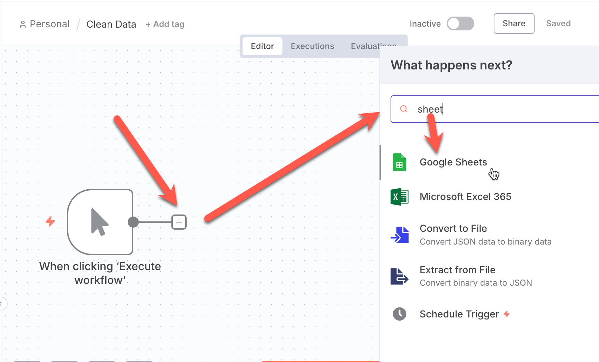
2. เลือก **Get row(s) in Sheet** action 
   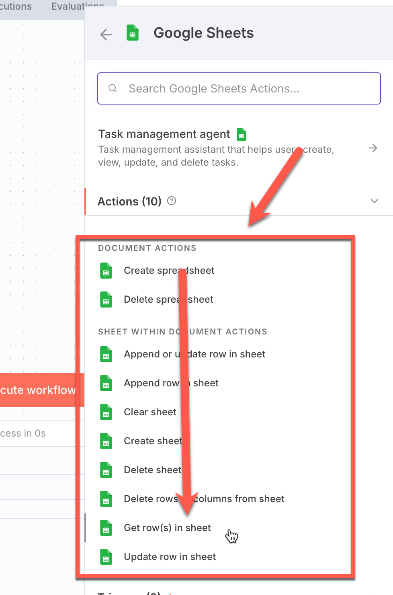
3. ในการเชื่อมต่อกับ Google ครั้งแรก ให้กดเลือก **Create new credential**
   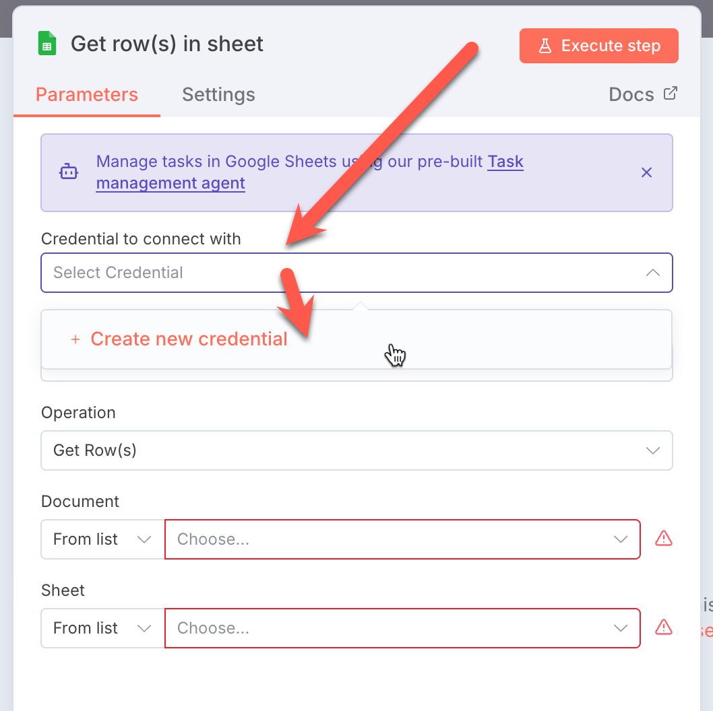
4. กดปุ่ม Sign in with Google และทำการอนุญาตให้เรียบร้อย
   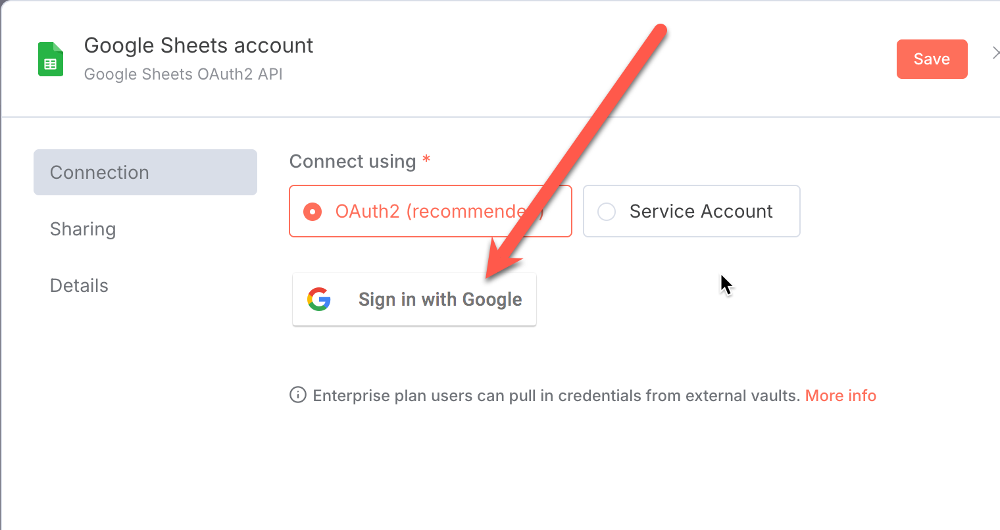
5. ถ้าสำเร็จ หน้าต่างจะแสดงกล่องสีเขียวดังภาพ เพื่อยืนยันการเชื่อมต่อ
   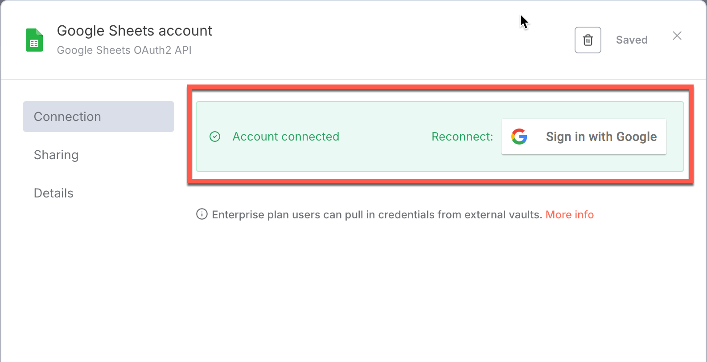
6. หลังจากเชื่อมต่อแล้ว ให้ตั้งค่าตามนี้
    - **Resource:** Sheet Within Document
    - **Operation:** Get Rows
    - **Document: (By List)** Dirty Data
    - **Sheet: (From List)** Sheet1 
   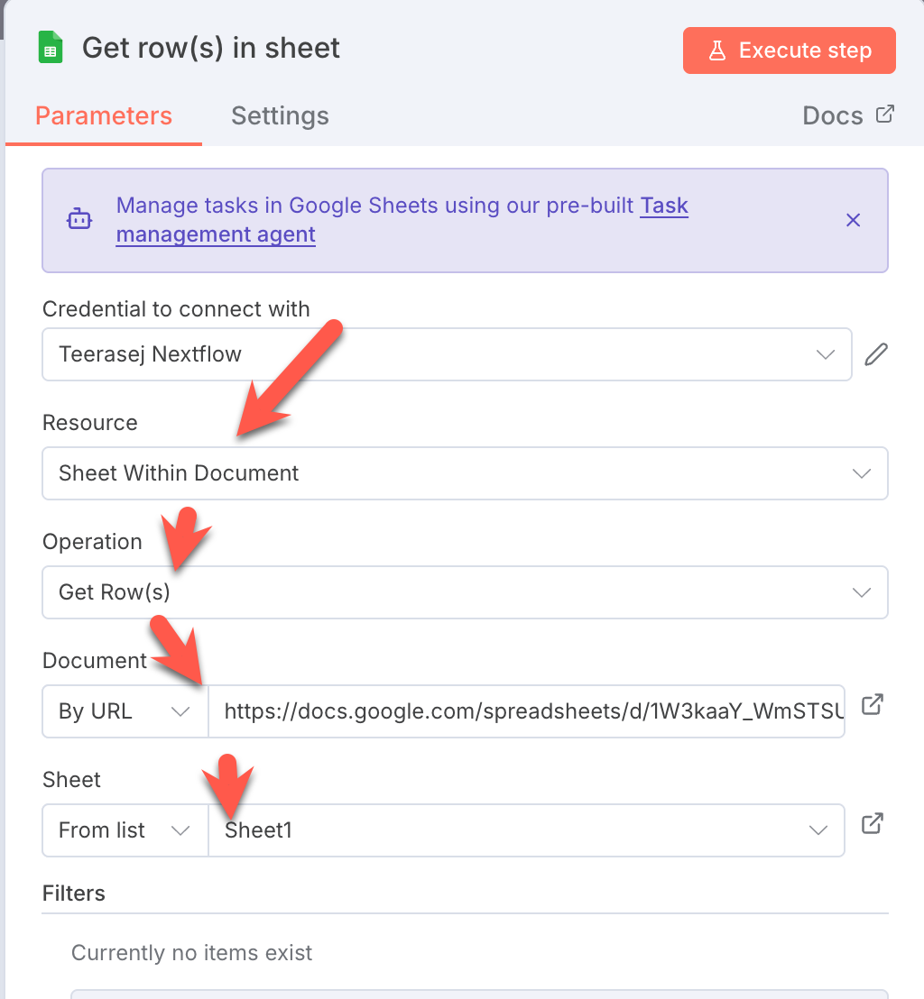
7. กด back to canvas ด้านบนซ้าย เพื่อกลับมาที่ editor

> เคล็ดลับ: เราสามารถเชื่อมต่อ Google Account อื่นได้ โดยการกดที่ปุ่มอีกทีครับ

### Step 3: สร้าง Node เพื่อ clean ข้อมูลชื่อ 

1. กดปุ่ม **+** เพื่อเพิ่ม node ใหม่ > เลือก **Edit Field (Set)** 
   
2. กำหนดค่าตามรายการด้านล่าง 
   - Name: Cleansing Prefix
   - Field to Set: 
     - ลากคอลัมภ์ `id` มาวางในช่องนี้
     - ลากคอลัมภ์ `name` มาวางในช่องนี้ และแก้สูตรเป็น 
       ```
       {{$json.name.replace(/^(คุณ|นาย|นางสาว|น.ส.|นาง)\s*/,'')}}
       ```
    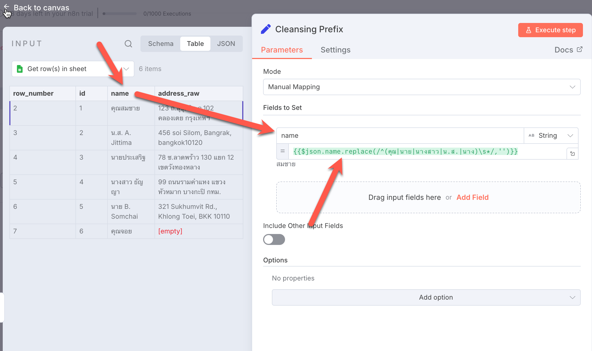

3. กดปุ่มทดสอบการทำงานให้ได้เหมือนดังภาพด้านบน (คำนำหน้าชื่อถูกลบไปแล้ว)
4. กด back to canvas ด้านบนซ้าย เพื่อกลับมาที่ editor

### Step 4: สร้าง Node เพื่ออัพเดทชื่อที่ปรับปรุงแล้วกลับเข้าไปใน sheet

1. กดปุ่ม **+** เพื่อเพิ่ม node ใหม่ > เลือก **Google Sheets** > เลือก **Update Row in Sheet** action  
2. ให้ตั้งค่าตามนี้
   1. เลือกเป้าหมายเป็น Google sheet ไฟล์เดิม ในหน้า Sheet1
   2. ตั้งค่า **Mapping Column Mode:** `Map Each Column Manually`
   3. ลากคอลัมภ์ `id` มาวางในช่อง **id (using to match)**
   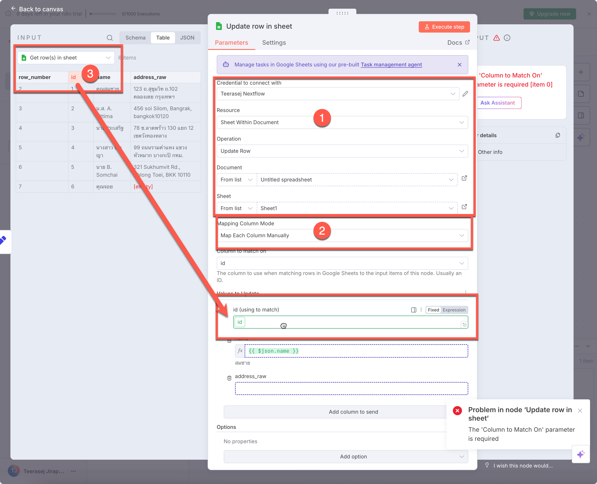

3. จาก input node **Cleansing Prefix** ลากคอลัมภ์ `name` มาวางในช่อง **name**
   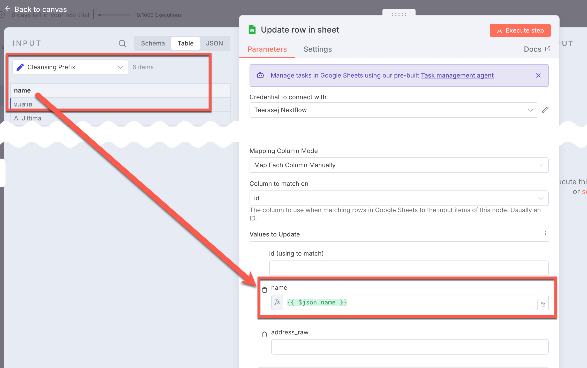

4. ทดสอบ execute node และดูผลลัพธ์ที่ไฟล์ Google Sheets
5. กลับมาที่ n8n กด back to canvas ด้านบนซ้าย เพื่อกลับมาที่ editor

### Step 5: สร้าง Node เพื่อใช้ AI Model ในการปรับที่อยู่

1. กดปุ่ม **+** เพื่อเพิ่ม node ใหม่ > เลือก **OpenAI** > เลือก **Message a model** action > ตั้งชื่อว่า `Address Cleaner`
2. ให้ตั้งค่าตามนี้
   1. ให้แน่ใจว่าได้เลือกการเชื่อมต่อกับ OpenAI ที่มี หรือสร้างไว้ก่อนหน้านี้
   2. Model: `gpt-4o-mini`
   3. จาก input node **Get row(s) in sheet** ลาก column **address_raw** มาวางในช่อง **Message Prompt**
   4. ให้แน่ใจว่าได้ตั้งค่า **Message Prompt** ดังนี้
        ```
        You are a Thai address cleaner. Normalize spacing and abbreviations. Don’t invent missing data. Output JSON with keys: address_clean.

        {{ $('Get row(s) in sheet').item.json.address_raw }}
        ```
    5. เปิดตัวเลือก **Simplify Output** และ **Output Content as JSON**
    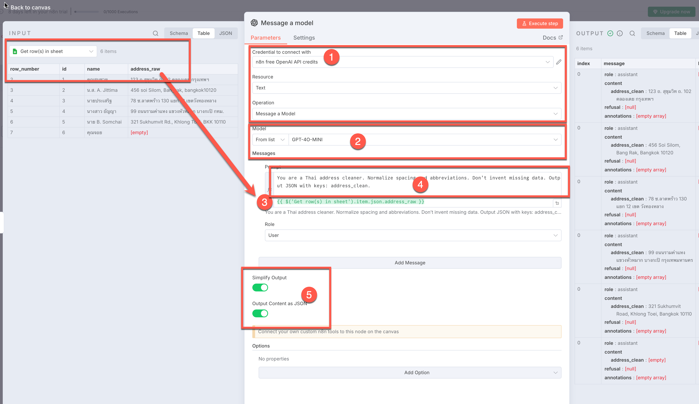

3. ทดสอบ execute node และดูผลลัพธ์ที่ได้

### Step 6: สร้าง Node เพื่อใช้ AI Model ในสกัดข้อมูลที่ต้องการ

1. กดปุ่ม **+** เพื่อเพิ่ม node ใหม่ > เลือก **OpenAI** > เลือก **Message a model** action > ตั้งชื่อว่า `Address Extractor`
2. ให้ตั้งค่าตามนี้
   1. ให้แน่ใจว่าได้เลือกการเชื่อมต่อกับ OpenAI ที่มี หรือสร้างไว้ก่อนหน้านี้
   2. Model: `gpt-4o-mini`
   3. จาก input node **Get row(s) in sheet** ลาก field **address_clean** มาวางในช่อง **Message Prompt**
   4. ให้แน่ใจว่าได้ตั้งค่า **Message Prompt** ดังนี้
        ```
        You are Thai address professional. You will extract postal code and province's name from given address. Output JSON with key: postal_code, province. Don't invent missing data, use empty string if value not found.
        {{ $json.message.content.address_clean }}
        ```
    5. เปิดตัวเลือก **Simplify Output** และ **Output Content as JSON**
    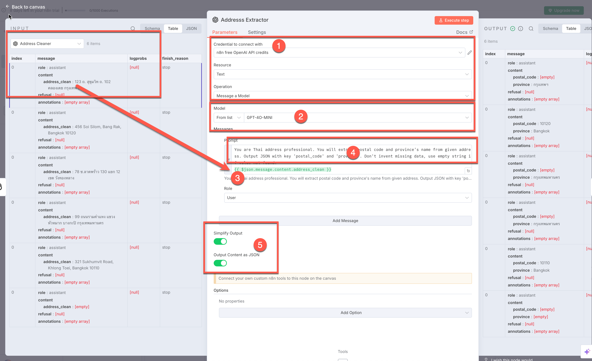
3. ทดสอบ execute node และดูผลลัพธ์ที่ได้

### Step 7: สร้าง Node เพื่อใช้ Update ข้อมูลที่อยู่ที่ได้จาก workflow ลง Google Sheet

1. กดปุ่ม **+** เพื่อเพิ่ม node ใหม่ > เลือก **Google Sheets** > เลือก **Update Row in Sheet** action  
2. ให้ตั้งค่าตามนี้
   1. เลือกเป้าหมายเป็น Google sheet ไฟล์เดิม ในหน้า Sheet1
   2. ตั้งค่า **Mapping Column Mode:** `Map Each Column Manually`
   3. Id: ให้ใช้ค่า `id` จาก node **Get row(s) in sheet**
   4. address_raw: ให้ใช้ค่า `address_clean` จาก node **Address Cleaner**
   5. postal_code: ให้ใช้ค่า `postal_code` จาก node **Address Extractor**
   6. province: ให้ใช้ค่า `province` จาก node **Address Extractor**
   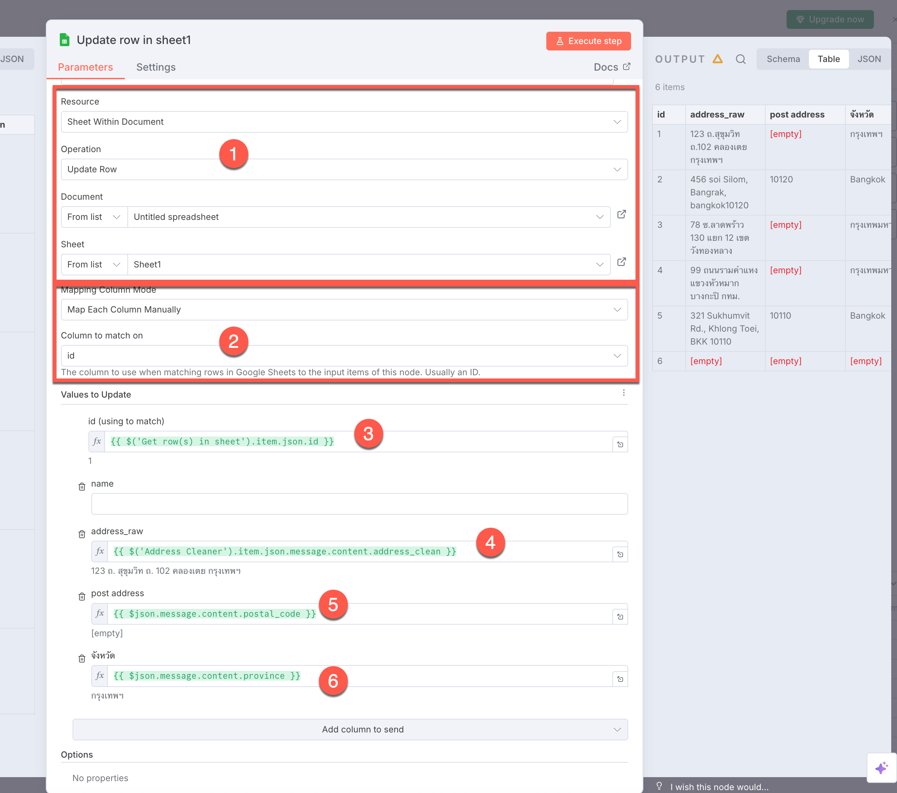
3. ทดสอบ execute node และดูผลลัพธ์ที่ไฟล์ Google Sheets


## สรุป

ในบทเรียนนี้เราได้เรียนรู้วิธีการใช้ n8n ในการทำงานกับ Google Sheets และ OpenAI API โดยมีขั้นตอนหลักๆ ดังนี้

1. การดึงข้อมูลจาก Google Sheets
2. การทำความสะอาดข้อมูลด้วย Regular Expressions
3. การใช้ AI Model ในการปรับที่อยู่และสกัดข้อมูลที่ต้องการ
4. การอัพเดทข้อมูลกลับไปยัง Google Sheets
